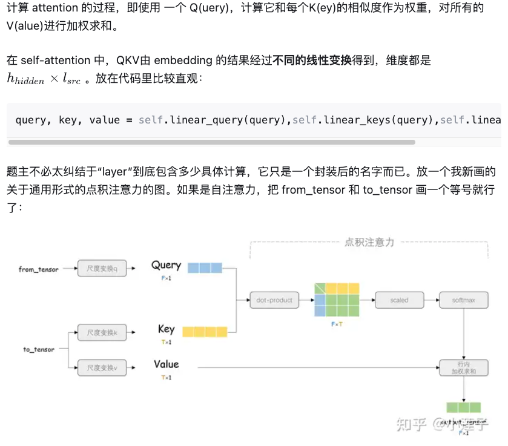
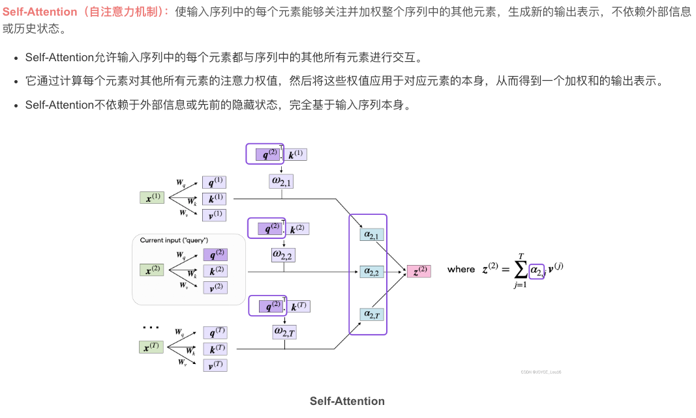
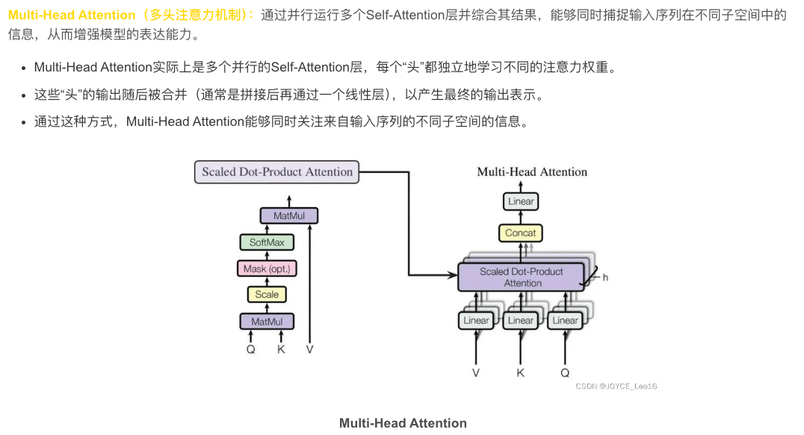
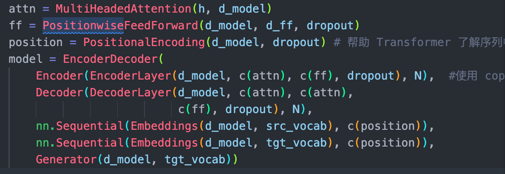

# 学习 transformer

:dizzy_face:尝试把学习时间调整到早上

> **学习目标**
>
> - 学习transformer 的框架图

## 1. Attention公式

> 这个图说 attention的 qkv 说的很清楚
> 链接:<https://zhuanlan.zhihu.com/p/383675526>

## 2. self-Attention 和 Multi-Head Attention的区别

> 这个图说self-Attention 和 Multi-Head Attention的区别说的很清楚
> 链接：<https://blog.csdn.net/leonardotu/article/details/135886678>

### 学习和复现项目的步骤

**~~1. 通读项目文档~~**

README 文件：先阅读项目的 README.md 文件，它通常包含项目的简介、依赖项、安装步骤以及如何运行的简单示例。
环境配置：确保你有正确的 Python 环境来运行这个项目。项目通常会提供依赖的包信息，比如 requirements.txt 或 environment.yml 文件，按文档中的说明配置环境。

~~**2. 理解代码结构**~~

- 目录结构：了解项目的文件结构，通常会有以下几个模块：
- 模型代码：实现 Transformer 或其他算法的核心部分。
  
  > 模型核心代码就在这一块
- 数据处理代码：负责数据的读取、清洗和预处理。
  > 输出处理，将 MMP 和 需要变化的性质作为输出输入，smi和性质变换根据vocabulary转换成 one hot
- 训练代码：用于模型训练、验证的主要逻辑。
  > 验证逻辑，是输出vocabulary里面每一个词的概率，和真实值进行比较。
- 配置文件：一些项目使用配置文件（如 .json 或 .yaml）来管理超参数。（！！！这倒确实没有看）

~~**3. 从高层开始理解**~~

- **入口点**：找到项目的入口文件，通常是一个 train.py 或者 main.py 文件。这个文件通常包含了训练模型的主要流程。
- **函数调用链**：从这个入口文件开始，理解代码的执行顺序。看一看模型是如何被初始化的，数据是如何加载的，损失函数和优化器是如何设置的。

> *Tips：在阅读代码的过程中，画出一个流程图，帮助你梳理数据流和模型执行的顺序。（画流程图有用吗，感觉好麻烦的样子）*

**4. 逐步修改和调试**

- **小范围修改**：开始复现时，不要一次性大幅修改代码，先从小范围的改动开始，比如改变模型的超参数或数据集的一些小设置。
- **Transformer 模型部分**：理解其架构，尤其是多头注意力机制、前馈网络和位置编码的实现。
- **损失函数**：查看项目中使用的损失函数和评价指标，确保你理解其作用。
- **数据预处理**：看如何将分子数据（如 SMILES）转化为模型输入。

**5. 拆分问题逐个攻破**

- **数据处理**：先确保你完全理解项目的数据处理方式，比如分子表示如何转化为模型可用的数据形式。
- **模型结构**：理解 Transformer 的架构，尝试从最简单的部分（如 Embeddings 和 Attention 层）开始，逐步理解其作用。
- **训练过程**：弄清楚模型如何进行训练，损失如何计算和反向传播，优化器如何更新参数。

**6. 实验和复现**

- **复现实验**：按照项目文档，运行作者提供的示例实验，看看是否能够复现他们的结果。
- **调试和记录**：在运行实验时，尽量记录每一步的输入输出，尝试调试代码，查看各个模块的输出，帮助你更好地理解其工作原理。

> *建议：使用简单的数据集或项目提供的预训练模型，先复现项目的结果，再逐步深入改动。将自己不理解的部分逐步分解，针对某个特定模块进行调试和学习。*

**7. 参考文献和学习资源**

- **查阅相关文献**：项目中涉及的算法，特别是 Transformer 和 MMP，通常会有相应的参考文献（如 "Attention is All You Need"）。多看文献结合代码来理解背后的原理。
- **在线教程**：如果某些 Transformer 或 MMP 的概念比较复杂，可以通过线上教程、博客或视频进行补充学习。

**总结**：

- 先从 项目文档和代码结构 入手，弄清楚项目如何运行。
- 理解项目的 高层逻辑，如模型、数据、训练流程等。
- 逐步从小修改入手，慢慢深入 核心模块。
- 如果遇到不懂的地方，先查阅文档或教程，再 实验和调试。
- 最后，结合文献和教程，逐步 复现 项目中的实验。

# ProteinMPNN

通过距离编码整合空间信息使ProteinMPNN能够捕获残基之间的结构关系，从而实现更准确的折叠预测并改善设计蛋白质的结构特性。

> *proteinMPNN的应用*：单体、组装体、循环寡聚体和纳米颗粒结构。

## ProteinMPNN 如何编码距离？

ProteinMPNN 使用**消息传递神经网络 (MPNN)** 架构对氨基酸残基之间的距离进行编码。-N、Ca、C、O 和虚拟 Cb 原子之间的距离使用 MPNN 进行编码和处理，以获得图节点和边缘特征。这种编码允许将空间信息整合到设计过程中，从而能够按随机解码顺序迭代生成氨基酸。通过编码和处理距离，ProteinMPNN 可以捕获残基之间的结构关系，这对于精确的蛋白质设计至关重要。

## 传统方法的局限性是什么？

传统蛋白质设计方法的局限性：基于物理的传统方法，例如rosetta，面临计算难度，因为需要计算所有可能结构的能量，包括不需要的寡聚态和聚合态。
设计目标与显式优化之间缺乏一致性通常需要进行自定义才能生成可正确折叠的序列。在限制范围方面可能会出现歧义，例如在蛋白质表面放置疏水氨基酸。传严重依赖人类专家的判断和专业知识，这使它们变得主观，并可能限制其稳健性 。传统方法（例如原生序列恢复）中使用的计算机指标可能与正确的折叠不相关，并且可能对晶体学分辨率敏感。
